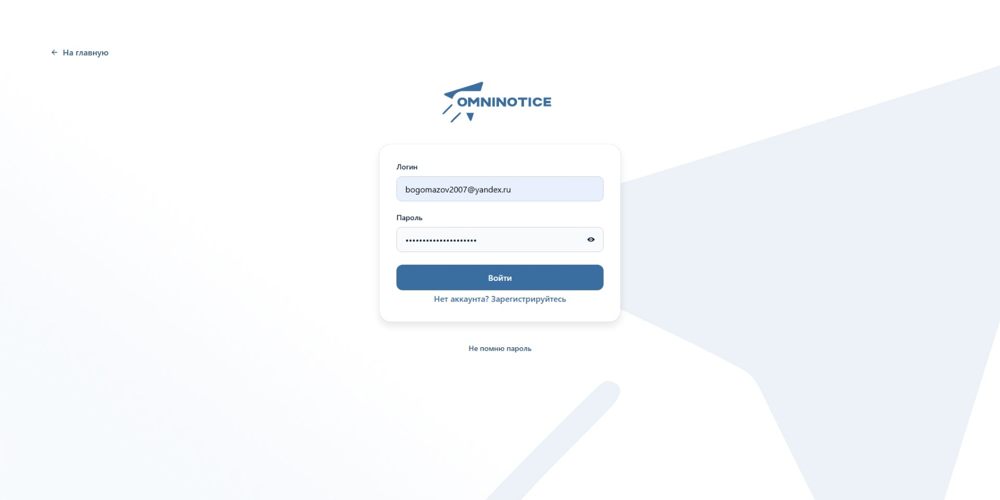
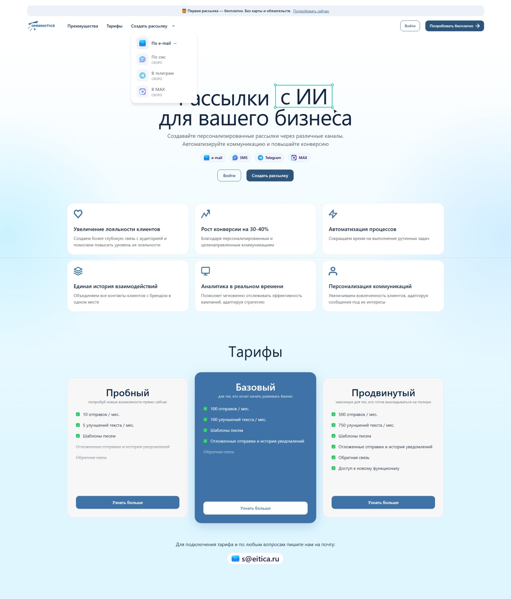
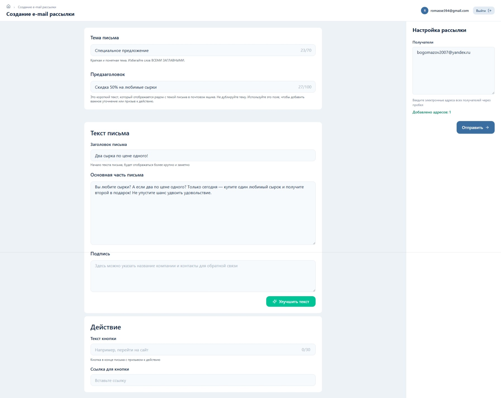
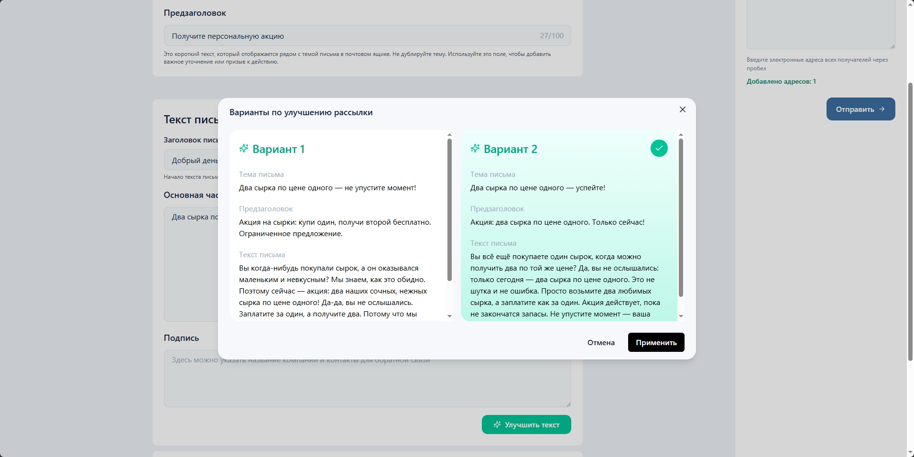

## О проекте

**OmniNotice** — это AI‑powered сервис для создания и отправки рассылок.<br>

Платформа позволяет пользователю создать email‑рассылку в несколько кликов, улучшить текст с помощью искусственного интеллекта и выбрать наиболее подходящий вариант перед отправкой.<br>
Проект ориентирован на упрощение процесса коммуникации с клиентами за счёт автоматизации и AI‑поддержки.<br>

## 🛠 Стек

React 18<br>
TypeScript<br>
Vite<br>
Chakra UI<br>
REST API<br>
React Hooks<br>
React Router<br>
Модульная компонентная архитектура<br>
Git<br>

## 💻 Моя роль в проекте (Frontend Developer)<br>

Разработка пользовательского интерфейса<br>
Проектирование структуры компонентов<br>
Интеграция с AI‑сервисом (Oracle)<br>
Интеграция с сервисом отправки писем (Synora)<br>
Реализация UX для генерации и выбора AI‑вариантов текста<br>
Работа с асинхронными запросами и обработкой состояний<br>
Типизация API с использованием TypeScript<br>
Оптимизация производительности<br>
Работа с переменными окружения<br>

## 🚀 Основной функционал<br>
Создание рассылки через удобный UI<br>
Генерация и улучшение текста с помощью AI<br>
Интеграция с микросервисом отправки email<br>
Работа с шаблонами писем<br>
Управление состояниями отправки<br>
Архитектура взаимодействия<br>
Frontend взаимодействует с двумя внутренними микросервисами:<br>

Synora — сервис отправки email‑сообщений<br>
Oracle — AI‑сервис для обработки и генерации текста<br>

## 🖼 Интерфейс приложения

### 🔐 Авторизация

<p align="center">  </p>

---

### 🏠 Главная страница

<p align="center">  </p>

---

### 📩 Страница создания рассылки

<p align="center">  </p>

---

### 🤖 Выбор AI‑варианта текста

<p align="center">  </p>

## ⚙️ Запуск проекта

```Bash
npm install
npm run dev
```
Откройте в браузере:

http://localhost:5173
## 🔐 Переменные окружения

Скопируйте файл:

```Bash
.env.example → .env
```
И при необходимости измените значения переменных.

## 🎯 Проект демонстрирует:

работу с AI‑интеграцией во frontend
построение удобного UX для сложных сценариев
грамотную работу с типизацией и API
